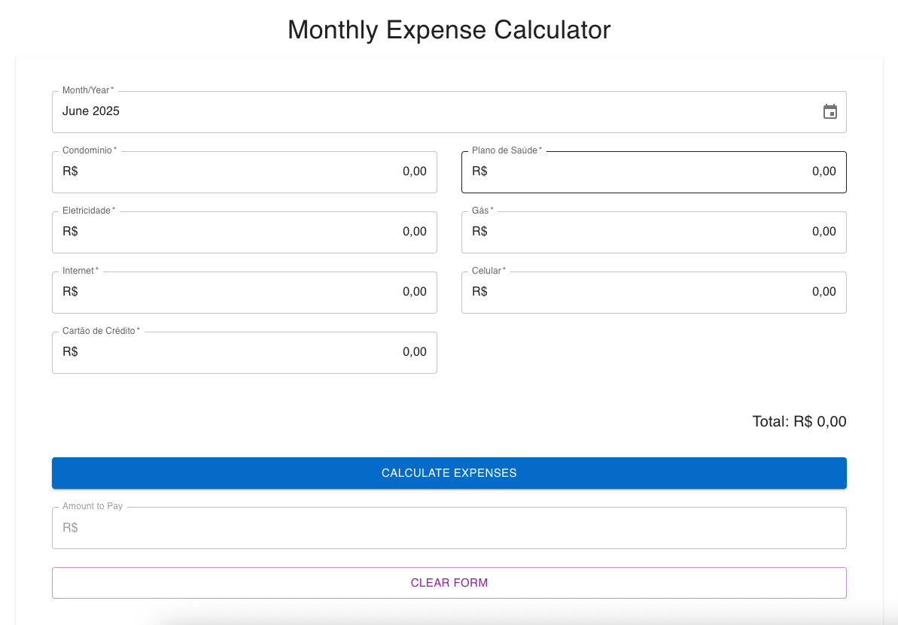

# Expense Calculator



A web application for tracking monthly household expenses including utilities, condominium fees, and other regular bills. The application automatically calculates the amount to pay based on a specific formula: (total of all expenses except condomínio / 2) - condomínio.

## Development Environment

- macOS
- Node.js
- SQLite

## Features

- Track monthly expenses by category:

  - Condomínio (Condominium fees)
  - Plano de Saúde (Health Insurance)
  - Eletricidade (Electricity)
  - Gás (Gas)
  - Internet
  - Celular (Mobile Phone)
  - Credit Card

- **Data Persistence**:

  - SQLite database storage for all expense data
  - Automatic data synchronization with backend API
  - Persistent storage between sessions and server restarts
  - Real-time data updates with loading states

- **PDF Export Functionality**:

  - Download complete expense reports as PDF
  - Individual expense detail PDFs
  - Professional formatting with Brazilian Real currency
  - Automatic file naming with timestamps

- Automatic calculations:
  - Total of all expenses
  - Amount to pay calculation: (total except condomínio / 2) - condomínio
- Monthly expense tracking by year/month
- Stored calculations for historical reference
- Simple and intuitive interface
- Comprehensive input validation
- Detailed error messages
- RESTful API with full CRUD operations
- Modern, responsive UI with Material-UI components

## Tech Stack

### Backend

- Node.js
- Express
- SQLite with Sequelize ORM
- Express Validator for input validation
- CORS for cross-origin requests

### Frontend

- React with TypeScript
- Material-UI (MUI) components
- Date-fns for date handling
- Form handling with controlled components
- Brazilian Real (R$) currency formatting
- Light/Dark theme support
- jsPDF for PDF generation
- jsPDF-AutoTable for professional table formatting

## Project Structure

```
sqlite-version/
├── backend/
│   ├── config/
│   │   └── database.js      # Database configuration
│   ├── models/
│   │   └── Expense.js      # Expense model definition
│   ├── middleware/
│   │   ├── expenseValidation.js  # Input validation
│   │   └── errorHandler.js       # Error handling
│   ├── routes/
│   │   └── expenses.js     # API routes
│   ├── database.sqlite     # SQLite database file
│   ├── API.md             # API documentation
│   ├── server.js          # Express server setup
│   └── package.json       # Backend dependencies
├── frontend/
│   ├── src/
│   │   ├── components/
│   │   │   ├── ExpenseForm.tsx   # Main expense form
│   │   │   └── ExpenseList.tsx   # Expense history display
│   │   ├── utils/
│   │   │   └── pdfGenerator.ts   # PDF generation utilities
│   │   └── App.tsx              # Main application component
│   └── package.json            # Frontend dependencies
├── FEATURES.md              # New features documentation
└── README.md
```

## Database Schema

The application uses SQLite with the following schema for expenses:

### Expense Table

| Field           | Type          | Description                          |
| --------------- | ------------- | ------------------------------------ |
| id              | INTEGER       | Primary key, auto-increment          |
| date            | DATE          | Month and year of expenses (YYYY-MM) |
| condominio      | DECIMAL(10,2) | Condominium fee                      |
| planoSaude      | DECIMAL(10,2) | Health insurance cost                |
| eletricidade    | DECIMAL(10,2) | Electricity bill                     |
| gas             | DECIMAL(10,2) | Gas bill                             |
| internet        | DECIMAL(10,2) | Internet bill                        |
| celular         | DECIMAL(10,2) | Mobile phone bill                    |
| creditCard      | DECIMAL(10,2) | Credit card bill                     |
| calculatedTotal | DECIMAL(10,2) | Stored total of all expenses         |
| amountToPay     | DECIMAL(10,2) | Final amount to be paid              |
| createdAt       | DATETIME      | Record creation timestamp            |
| updatedAt       | DATETIME      | Record update timestamp              |

## API Features

- Full CRUD operations for expenses
- Input validation:
  - Date format validation (YYYY-MM)
  - Numeric field validation
  - Required fields checking
- Error handling:
  - Structured error responses
  - Field-specific error messages
  - Different error types (validation, database, server)
- Automatic calculations:
  - Total expense calculation
  - Amount to pay tracking
- Monthly filtering

For detailed API documentation, see [backend/API.md](backend/API.md)

## Setup

1. Clone the repository

```bash
git clone git@github.com:FaraiB/expense-calculator.git
cd expense-calculator/sqlite-version
```

2. Install backend dependencies and start the server

```bash
cd backend
npm install
node server.js
```

The server will start on port 5001 by default.

3. Install frontend dependencies and start the development server

```bash
cd ../frontend
npm install
npm run dev
```

The frontend development server will start and the application will be available in your browser.

## Usage

### Data Persistence

- All expense calculations are automatically saved to the SQLite database
- Data persists between sessions and server restarts
- Real-time synchronization with the backend API

### PDF Downloads

- **Complete Report**: Click "Download All as PDF" to generate a comprehensive report of all expenses
- **Individual Report**: Click the download icon (📥) next to any expense to get a detailed report
- PDFs are automatically named with timestamps and downloaded to your default downloads folder

## Development Status

- [x] Project structure setup
- [x] Database configuration
- [x] Expense model implementation
- [x] API routes implementation
- [x] Input validation
- [x] Error handling
- [x] API documentation
- [x] Frontend development
  - [x] Expense form implementation
  - [x] Amount calculation
  - [x] Expense list with edit/delete
  - [x] Currency formatting
  - [x] Date handling
- [x] Data persistence with SQLite
- [x] PDF export functionality
- [x] Testing
  - [x] Backend API tests (15 tests passing)
  - [x] Frontend component tests (basic setup)
- [ ] Deployment

## Testing

The application includes comprehensive testing for both backend and frontend.

### Backend Tests

```bash
cd backend
npm test                    # Run all tests
npm run test:watch         # Run tests in watch mode
npm run test:coverage      # Run tests with coverage report
```

### Frontend Tests

```bash
cd frontend
npm test                   # Run all tests
npm run test:watch         # Run tests in watch mode
npm run test:coverage      # Run tests with coverage report
```

### Test Coverage

- **Backend**: 15 tests covering all API endpoints, validation, and calculations
- **Frontend**: Component tests for form functionality and user interactions

For detailed testing information, see [TESTING.md](TESTING.md).

## Contributing

Feel free to contribute to this project:

1. Fork the repository
2. Create your feature branch (`git checkout -b feature/AmazingFeature`)
3. Commit your changes (`git commit -m 'Add some AmazingFeature'`)
4. Push to the branch (`git push origin feature/AmazingFeature`)
5. Open a Pull Request
